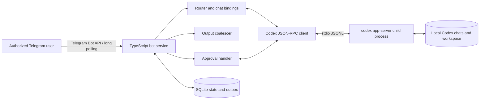

# Telegram Remote for Codex — Feature Specification

Status: Draft for implementation  
Target: single-user, single-machine installation  
Primary platform: macOS; Linux-compatible service wrapper may follow  
Chosen implementation language: TypeScript on Node.js 22+

## 1. Summary

Build a Telegram bot that runs on the same machine and under the same OS user as Codex. The bot uses Telegram long polling, so the host makes outbound connections only and does not expose a port or require NAT configuration.

The bot connects to a locally spawned `codex app-server` over stdio. It lets an authorized user:

- switch between allowlisted local projects;
- list local Codex chats;
- select or create a chat;
- send a prompt to the selected chat;
- see streamed progress and the final response;
- answer approval and user-input requests;
- stop a running turn;
- switch between Codex chats while other turns continue.

Diff delivery is phase 2: first as a unified `.diff` attachment, then optionally as rendered images.

This is a personal remote control, not a multi-tenant Telegram service.

## 2. Goals and non-goals

### 2.1 Goals

1. Operate local Codex chats from a mobile phone with no inbound network exposure.
2. Switch quickly between allowlisted projects and their Codex chats, and route every message unambiguously.
3. Stream useful output without flooding Telegram or exceeding Telegram limits.
4. Preserve Codex approval boundaries and make pending approvals actionable on mobile.
5. Recover cleanly after a bot, Codex app-server, network, or machine restart.
6. Minimize the risk of exposing the host through Telegram.

### 2.2 Non-goals for v1

- Remote control of the Codex desktop UI.
- Guaranteed live mirroring of a turn started in a separate Codex desktop or CLI process.
- Raw remote shell access. In particular, do not expose `thread/shellCommand`; it runs outside the thread sandbox with full host access.
- Group or public-channel use.
- Multiple Telegram users or shared team authorization.
- Uploading arbitrary Telegram attachments into the workspace.
- Managing cloud-only Codex tasks that are not present in the local Codex home.
- Archiving, deleting, or rolling back Codex chats.

## 3. Important product boundary

`codex app-server` is the supported local programmatic interface. It supports JSON-RPC, local stdio transport, chat listing/reading/resuming, streamed turn events, approvals, interruption, and aggregated turn diffs.

The bot starts and owns one long-lived app-server child process. Events are guaranteed for chats that this connection starts or resumes. A separate desktop/CLI process has a separate live connection, so its in-progress event stream is not guaranteed to reach the bot. V1 behavior is therefore:

- existing persisted local chats: list and read;
- turns started by the bot: fully stream and control;
- turns started in another client: show after they have been persisted and refreshed; live synchronization is best-effort and not part of acceptance criteria;
- simultaneous use of the same chat from the bot and another Codex client: unsupported and warned against.

Only chats stored under the same OS user, Codex home, and authentication context are in scope.

## 4. Technology choice

Use TypeScript on Node.js 22+.

Recommended libraries:

- `grammy` for Telegram Bot API and long polling;
- Node `child_process` and `readline` for app-server JSONL stdio;
- `better-sqlite3` for small, durable local state;
- `zod` for configuration and boundary validation;
- `pino` for structured logs with redaction;
- `vitest` for tests.

Reasons for TypeScript:

- the Codex CLI can generate version-matched TypeScript definitions with `codex app-server generate-ts`;
- Telegram bot libraries and callback/query handling are mature;
- one event-driven runtime can handle Telegram updates, JSON-RPC requests, Codex notifications, streaming coalescing, and timers;
- deployment remains a single local process plus its Codex child process.

Do not hand-maintain the full Codex protocol schema. Generate it from the installed Codex CLI during development and pin the tested Codex CLI version range.

## 5. Architecture



### 5.1 Components

`TelegramGateway`

- receives updates by long polling;
- rejects unauthorized updates before parsing commands;
- sends, edits, chunks, and attaches messages;
- disables link previews by default.

`CommandRouter`

- implements Telegram control commands and inline keyboards;
- maps normal text to the selected Codex chat;
- validates chat selection and active-turn rules.

`CodexRpcClient`

- spawns `codex app-server --listen stdio://`;
- performs `initialize` then `initialized` exactly once per child process;
- correlates JSON-RPC responses by request id;
- dispatches notifications and server-initiated requests by chat and turn id;
- restarts the child with bounded exponential backoff.

`TurnCoordinator`

- tracks one active turn per Codex chat;
- allows turns in different chats concurrently, up to a configurable global limit;
- owns queued prompts, `/steer`, cancellation, and finalization;
- serializes all state transitions per Codex chat.

`OutputCoalescer`

- accumulates agent-message deltas;
- edits at most once every 1.5 seconds per displayed message;
- starts a new Telegram message before reaching the Telegram text limit;
- treats `item/completed` as authoritative and `turn/completed` as terminal;
- never publishes raw model reasoning.

`ApprovalCoordinator`

- converts Codex approval and user-input requests to Telegram inline keyboards;
- persists one-time callback tokens;
- validates user, Telegram chat, Codex chat, turn, expiry, and unused status;
- answers the original app-server request exactly once.

`StateStore`

- SQLite in WAL mode;
- stores projects, per-project chat bindings, turn state, pending approvals, Telegram delivery ids, and an outbox;
- never stores the Telegram bot token;
- does not retain prompt or response bodies by default, except prompt text waiting in the bounded queue and short-lived outbound message bodies.

## 6. User experience

### 6.1 Default interaction model

V1 uses one private Telegram conversation with the bot. The user has one selected project and one selected Codex chat within that project. Every bot response begins with a short project and chat label so switching cannot silently misroute a prompt.

Example:

```text
[pupa / Fix login timeout]
Working…
```

The selected project remains selected across restarts. The bot also remembers the last selected chat independently for every project, so switching away from a project and back restores its prior chat in one action.

The main Telegram keyboard exposes `Projects`, `Chats`, `Status`, and `Stop`. Project and chat selection use inline buttons; typing ids is a fallback rather than the primary mobile flow.

### 6.2 Commands

| Command | Required behavior |
|---|---|
| `/pair <one-time-code>` | Complete first-use pairing for the configured numeric user id, delete the code message where Telegram permits, and permanently invalidate the code. Unavailable after pairing. |
| `/start` | Verify authorization, show the selected project and Codex chat, and show the main keyboard. |
| `/projects` | Show recent and configured projects as inline buttons, with the selected project marked. Selecting a project restores its last selected chat and immediately shows that project's chats. |
| `/project <alias>` | Select a project by its unique alias. Inline selection from `/projects` is the primary flow. |
| `/chats [all]` | List the 10 most recently updated chats in the selected project. `all` searches every allowlisted project. Include project label, status, Select, New chat, Next, and Previous buttons. |
| `/find <text>` | Search project aliases, paths, chat titles, and previews; return grouped Project and Chat results. |
| `/use <short-id>` | Select a chat. Inline selection from `/chats` is the primary flow. |
| `/new [project-alias]` | Create and select a chat in the selected project, or first show the project picker when no project is selected. Never accept an arbitrary filesystem path. |
| `/where` | Show selected project, chat title, full Codex chat id, working directory, and current bot-owned turn status. |
| `/history [n]` | Show the last 1–10 user/final-response pairs from persisted history; default 3. |
| `/status` | Show running/queued state, elapsed time, last tool status, and pending approval state. |
| `/stop` | Confirm, then call `turn/interrupt` for the bot-owned active turn. |
| `/steer <text>` | Add text to the active turn using `turn/steer`; fail clearly if no turn is active. |
| `/diff` | Phase 2: send the most recent captured unified diff for the selected chat. |
| `/help` | Show concise command help and the currently selected chat. |

Any non-command text is a Codex prompt for the selected chat. If a project is selected but it has no selected chat, the bot asks the user to select an existing chat or press `New chat`; it must not guess a destination.

If the selected chat is idle, the bot starts a turn. If it is running, ordinary text is queued as the next turn; it is not silently used as steering. The per-chat queue limit is 5 prompts. `/steer` is the explicit way to alter an in-progress turn.

Bot control commands must never be forwarded to Codex.

### 6.3 Project selection

A project is a canonical local directory from the configured allowlist. The project registry is assembled from:

1. explicitly configured aliases and paths;
2. working directories of existing Codex chats that fall inside an allowed parent directory;
3. optionally, direct child directories containing `.git` under configured discovery parents.

Discovery is read-only, defaults to one directory level, ignores hidden directories and symlinks escaping the allowed parent, and runs at startup plus on explicit refresh. An inferred project is never allowed merely because a Telegram message names its path.

Each project button shows its alias, abbreviated path, number of indexed chats, active-turn count, and last-used time. Sort by last used, then alphabetically. If two projects share a directory name, derive stable unique aliases such as `backend` and `backend-2`; aliases are display conveniences and canonical paths remain the database identity.

Selecting a project:

1. updates the current project;
2. restores that project's last selected chat if it is still available;
3. otherwise selects no chat;
4. displays up to 10 recent chats plus a prominent `New chat` button.

Selecting a chat automatically selects its owning project. Running turns in other projects continue and remain labeled.

### 6.4 Chat selection

Each list item shows:

- title, or truncated preview if no title exists;
- a stable 8-character display id derived from the Codex chat id;
- project alias and shortened working directory;
- last-updated time;
- bot-local state: idle, running, waiting for approval, queued, or unknown/external.

The full Codex id remains the database key. A short id is accepted only when it uniquely matches one currently indexed chat; ambiguity must produce a selection list.

Chat listing explicitly requests all relevant local interactive source kinds rather than relying on app-server's default source filter. The initial set is `cli`, `vscode`, `appServer`, and `unknown`. Unsupported source kinds must be ignored gracefully across Codex versions.

By default, do not index or expose chats whose canonical working directory is outside all allowed project roots or discovery parents.

### 6.5 Streaming output

Show these events:

- agent commentary and final answer;
- concise command execution state: command display, running/completed/failed, exit code;
- concise file-change state and number of changed files;
- plan status, coalesced into one edited message;
- warnings and turn failures;
- approval and user-input requests.

Do not show:

- raw reasoning or hidden reasoning deltas;
- environment variables, bot token, Codex credentials, or app-server protocol dumps;
- raw command output by default. A future opt-in `/logs` feature may expose bounded, redacted output.

Rules:

1. Coalesce delta edits to avoid Telegram rate limits.
2. Prefer editing an in-progress message; send an immutable final message at turn completion.
3. Split long output on paragraph or code-block boundaries with a conservative 3,800-character limit.
4. If MarkdownV2 escaping fails, retry as plain text.
5. Disable URL previews.
6. Include the chat label on every new message, attachment caption, and approval.
7. On `turn/completed`, reconcile displayed content with completed agent-message items.

### 6.6 Approvals and questions

V1 must handle these blocking requests:

- command execution approval;
- file-change approval;
- network or filesystem permission approval;
- structured user input with supported simple choices;
- MCP/app confirmation requests where the request can be represented safely.

Approval message example:

```text
[pupa / Fix login timeout]
Approval required: run command
cwd: /Users/me/project
command: pnpm test
reason: Verify the change
Expires in 10 minutes.
```

Buttons:

- `Allow once`
- `Decline`
- `Cancel turn`

Expose `Allow for session` as the accurate label for Codex's session-scoped approval. A decision must be bound to the authorized Telegram user and be one-time. Default expiry is 10 minutes. On expiry, decline the request when the protocol permits; otherwise interrupt the turn and report the timeout.

Destructive-looking commands are still displayed for an explicit decision; the bot must not auto-approve based on text classification. Managed Codex policy remains authoritative.

### 6.7 Multiple projects, chats, and concurrency

- One active turn per Codex chat.
- Up to 3 simultaneous bot-owned turns across different chats by default.
- Further prompts are queued fairly in arrival order.
- A failure or approval in one chat must not block event processing for another.
- Every callback and event lookup is keyed by full Codex chat id and turn id.
- Switching the selected chat does not stop a running turn. The bot continues sending that turn's output with its chat label.
- Switching projects is a routing/UI change only; it does not stop or reprioritize work in the previous project.

## 7. Codex integration

### 7.1 Process and transport

Spawn:

```text
codex app-server --listen stdio://
```

Use newline-delimited JSON over stdin/stdout. Never expose the app-server on a non-loopback TCP interface. Stdio avoids local port conflicts and removes a second authentication boundary.

Pass an explicit, minimal environment to the child while preserving the variables Codex needs. Do not log the child environment. Capture stderr to a size-limited rotating local log.

On startup:

1. resolve and validate the configured Codex executable;
2. run a version check;
3. start the child;
4. send `initialize` with client name `codex_telegram_remote` and the application version;
5. send `initialized` after a successful response;
6. run a health request such as `thread/list`;
7. begin Telegram polling only after Codex is ready, or show a degraded status if Telegram is already running.

### 7.2 Protocol methods used in v1

- `thread/list`
- `thread/read` with turns when history is requested
- `thread/start`
- `thread/resume`
- `turn/start`
- `turn/steer`
- `turn/interrupt`
- relevant approval/user-input server-request responses

Notifications consumed:

- `thread/status/changed`
- `turn/started`
- `turn/completed`
- `turn/plan/updated`
- `item/started`
- `item/completed`
- `item/agentMessage/delta`
- `item/commandExecution/outputDelta` for bounded internal aggregation only
- warnings, errors, and `serverRequest/resolved`
- phase 2: `turn/diff/updated`

### 7.3 New chat defaults

New chats may be created only in a selected project from the configured allowlist. Do not accept an arbitrary path from Telegram. Canonicalize the selected project again immediately before `thread/start` to prevent stale symlink or mount changes from bypassing the allowlist.

Defaults:

- workspace-write sandbox;
- approval-on-request policy;
- model and reasoning settings inherited from local Codex configuration;
- `serviceName` set to `codex_telegram_remote`;
- no experimental app-server capability unless a required, tested feature needs it.

The bot must not weaken managed Codex requirements. If a configured default is rejected by policy, report the rejection and do not retry with broader permissions.

### 7.4 Existing chats

Use `thread/read` to preview history without subscribing. Call `thread/resume` only immediately before a bot-initiated turn or when a bot-owned active session must be restored.

Do not continuously resume every listed chat. This limits resource use and avoids creating misleading subscriptions.

The bot maintains its own ownership marker for turns it starts. It must never send `turn/interrupt`, steering, or an approval response for a turn it does not own, unless a future version provides a verified shared-session mechanism.

### 7.5 Authentication and JetBrains Central/custom providers

The bot must reuse the machine's working Codex provider and authentication configuration. It must not substitute a direct OpenAI API key or copy credentials into Telegram-specific storage.

Current deployment observation, recorded without credential values:

- the local Codex configuration selects the custom model provider `wire`, believed to be the JetBrains Central gateway;
- Codex reports the cached login mode as ChatGPT;
- no JetBrains Central behavior should be hardcoded into chat routing or the Codex protocol client.

V1 authentication mode is `inherit`:

1. run the bot and app-server under the same non-admin OS user as the working Codex installation;
2. use the same canonical `CODEX_HOME` and configuration layering;
3. preserve the selected custom model provider, model, managed requirements, corporate proxy, and CA configuration;
4. give the app-server child only the environment variables required by Codex and the provider;
5. allow access to the same OS keychain entries when Codex uses keychain credential storage;
6. never pass tokens in process arguments, Telegram messages, SQLite, or logs.

At service startup, perform an app-server `account/read` and configuration/provider health check. This verifies configuration shape but may not prove that a custom inference gateway accepts requests. Installation and `doctor --probe-turn` therefore include an explicit, user-triggered minimal inference probe against a disposable chat. Do not run a billable probe on every restart.

Supported provider patterns:

- Codex-managed ChatGPT or API-key login: rely on Codex's credential cache and refresh behavior.
- Custom provider with `requires_openai_auth`: rely on the same Codex login cache.
- Custom provider with `env_key`: resolve that named secret from the service's secure environment or OS secret store and pass it only to the app-server child.
- Provider requiring host-managed short-lived ChatGPT tokens: phase-gated adapter using app-server's experimental `chatgptAuthTokens` login and `account/chatgptAuthTokens/refresh` request. This is not enabled unless JetBrains Central actually requires it and contract tests cover refresh deadlines and failures.

If JetBrains Central authentication works only inside the desktop process, or requires an undocumented app-only token exchange, milestone 0 stops before Telegram integration and implements or obtains an approved non-interactive provider adapter. Do not scrape tokens from desktop process memory or private storage.

When authentication expires, the bot reports a generic local-reauthentication requirement without including account data or provider responses. Browser/device-code authentication is not forwarded through Telegram in v1. The user reauthenticates locally, then runs `/status` or retries the prompt.

Company data policy is a separate release gate: the owner must confirm that sending repository-derived text through a Telegram bot is allowed. Authentication success does not imply approval to move data into Telegram.

## 8. Diff delivery — phase 2

Capture the latest `turn/diff/updated` value for each bot-owned turn. Replace the stored value on every event because each event is an aggregated snapshot, not an append-only fragment.

### 8.1 Minimum diff feature

- At turn completion, show file count and added/removed line counts.
- Add `View diff` and `Download .diff` buttons when changes exist.
- For a diff up to 3,500 characters, send escaped monospaced text.
- For a larger diff, send a UTF-8 `.diff` document.
- Retain only the last 10 diffs or 7 days, whichever is smaller.

### 8.2 Rendered diff feature

Render unified diff to static, escaped HTML with side-by-side and unified modes, then take local screenshots with Playwright/Chromium. Requirements:

- no remote fonts, scripts, images, or network requests;
- syntax theme with readable mobile contrast;
- header per file with path and line statistics;
- split screenshots by file and at a practical image height;
- always retain the `.diff` attachment as the lossless source;
- if rendering fails, send the `.diff` without failing the turn.

Never render unescaped repository content as HTML.

## 9. Persistence model

Minimum SQLite tables:

`settings`

- schema version;
- selected canonical project id;
- selected Codex chat id;
- last successful Codex version check.

`projects`

- canonical directory as identity, display alias, discovery source, and enabled state;
- last-used and last-refreshed timestamps;
- canonical allowed-parent relationship.

`project_chat_selections`

- project id and its last selected Codex chat id;
- selection timestamp;
- exactly one row per project.

`codex_chats`

- full chat id, owning project id, title, preview, cwd, source kind, timestamps;
- last refreshed time;
- no transcript body.

`turns`

- chat id, turn id, bot ownership flag, state, timestamps;
- Telegram progress/final message ids;
- terminal error summary;
- queued-prompt count, not queued-prompt content in diagnostic views.

`prompt_queue`

- encrypted-at-rest prompt body if an OS-backed key is available; otherwise plain SQLite with file mode `0600` and a documented warning;
- chat id, order, creation time, retry count.

`pending_requests`

- opaque random callback token hash;
- JSON-RPC request id, chat id, turn id, request kind, expiry, used time;
- minimum request payload required to render and answer it.

`outbox`

- idempotency key, Telegram method, payload, state, attempt count, next-attempt time;
- delete delivered bodies after a short retention period.

`diffs` (phase 2)

- chat id, turn id, compressed unified diff, timestamps.

Database and log files must be created with owner-only permissions.

## 10. Security requirements

1. Require an explicit numeric `TELEGRAM_ALLOWED_USER_ID`. Usernames are not authorization identifiers.
2. Require private-chat scope in v1. Reject groups, channels, inline queries, and forwarded command contexts.
3. Use a second pairing secret on first use. Store only its verifier; disable pairing after success.
4. Store `TELEGRAM_BOT_TOKEN` in an environment file with mode `0600` or the OS secret store. Never place it in source, SQLite, command-line arguments, or logs.
5. Telegram bot conversations are not end-to-end encrypted. Show this warning during pairing and in the README.
6. Restrict project discovery, chat listing, history, resume, and new-chat operations to configured canonical project roots or allowed parent directories. Resolve symlinks before checking containment.
7. Do not expose raw shell execution, arbitrary file reads, arbitrary local-image paths, chat deletion, or configuration writes.
8. Default to allow-once approvals only. Do not auto-approve.
9. Sign or randomize callback data, bind it to context, expire it, and make it one-use.
10. Redact common credential patterns from outbound text and logs. Redaction is defense in depth, not a guarantee.
11. Limit inbound prompt size to 12,000 UTF-8 characters and rate-limit to 10 prompts per minute with a small burst.
12. Limit total queued prompts and total concurrent turns.
13. Run under the same non-admin OS account as Codex. Do not run as root.
14. Disable Telegram webhook mode; long polling is the only v1 ingress.
15. Keep dependencies and the tested Codex CLI version pinned, and fail closed on an incompatible protocol major/schema check.
16. Inherit the configured company/custom model provider without storing or displaying its credentials. Provider errors sent to Telegram must be sanitized.
17. Treat Telegram data-transfer approval as a separate company-policy release gate; successful JetBrains Central authentication is not sufficient authorization.

## 11. Reliability and recovery

### 11.1 Telegram

- Use long polling with only the update types the bot needs.
- Run exactly one poller for a bot token.
- Retry transient API failures with exponential backoff and jitter.
- Treat Telegram 429 `retry_after` as authoritative.
- Use a local outbox idempotency key so a restart does not resend a message that has a recorded Telegram acknowledgement.
- Telegram does not provide a send idempotency key. If the connection fails after Telegram accepted a send but before the bot recorded the response, delivery is ambiguous: retry once with a `[recovered]` label and accept that a duplicate is possible. Prefer a rare duplicate over silently losing the final result.
- Do not retry permanent chat-blocked or malformed-message errors indefinitely.

### 11.2 Codex app-server

- Detect child exit and malformed protocol lines.
- Reject or time out outstanding JSON-RPC calls when the child exits.
- Restart at 1, 2, 5, 10, then 30 second intervals with jitter.
- Circuit-break after 10 consecutive failures and alert the authorized Telegram user when possible.
- After restart, initialize a new connection, refresh chat metadata, and inspect bot-owned unfinished turns through persisted history.
- Never assume an old JSON-RPC request id or approval request remains valid after child restart.
- Mark interrupted/unknown turns honestly; do not automatically replay a prompt unless the store proves `turn/start` was never acknowledged.

### 11.3 Shutdown

On SIGTERM/SIGINT:

1. stop accepting new Telegram prompts;
2. persist coalescer state and pending delivery records;
3. allow active event handling to drain for up to 20 seconds;
4. do not call `turn/interrupt` automatically, but mark any still-active turn `unknown` because stopping its app-server process may end it;
5. close Telegram polling;
6. terminate the app-server child gracefully, then force it only after a timeout;
7. close SQLite.

## 12. Configuration

Example environment/config inputs:

```text
TELEGRAM_BOT_TOKEN=<secret>
TELEGRAM_ALLOWED_USER_ID=123456789
PAIRING_SECRET_HASH=<argon2id verifier>
CODEX_BIN=/absolute/path/to/codex
CODEX_HOME=/Users/me/.codex
AUTH_MODE=inherit
DATA_DIR=/absolute/path/to/private/data
PROJECT_ROOTS=/Users/me/project-a,/Users/me/project-b
PROJECT_PARENT_DIRS=/Users/me/IdeaProjects
PROJECT_DISCOVERY_DEPTH=1
MAX_CONCURRENT_TURNS=3
LOG_LEVEL=info
```

`PROJECT_ROOTS` contains explicit project directories. `PROJECT_PARENT_DIRS` contains directories whose eligible children may become projects; it does not make every descendant path valid without canonical containment and discovery checks. For installations with many projects, prefer a validated TOML alias map over comma-separated environment values.

Secrets must not be committed. Non-secret configuration may use a validated TOML file. Environment values override TOML. Provider-specific secrets should be referenced by secret name or keychain entry rather than embedded in TOML.

On macOS, ship a `launchd` user agent. It must use `KeepAlive`/restart behavior, a fixed working directory, absolute executable paths, and owner-only stdout/stderr log files. A Linux systemd user service is optional.

## 13. Observability

Structured logs include:

- service lifecycle and version;
- Telegram update id and authorized user id hash, not message body;
- Codex chat id hash, turn id hash, method/event type, state transition, and duration;
- delivery attempts and error class;
- app-server restart count and exit status.

Never log:

- Telegram token or pairing secret;
- prompts or full Codex responses by default;
- command output;
- environment dumps;
- Codex authentication material;
- full approval callback tokens.

Provide `/status` for user-visible health and a local `doctor` CLI command for executable paths, permissions, SQLite integrity, Telegram connectivity, Codex version, and app-server handshake.

## 14. Testing strategy

### 14.1 Unit tests

- authorization and private-chat rejection;
- command parsing and non-command routing;
- short-id collision handling;
- Telegram escaping, chunking, and coalescing;
- callback token expiry, binding, and one-time use;
- per-chat state machine and queue behavior;
- secret redaction;
- project-root canonicalization and traversal rejection;
- aggregated diff replacement rather than concatenation.

### 14.2 Protocol contract tests

Generate the TypeScript schema from the installed pinned Codex CLI. Run a real local app-server in a temporary Codex home where practical and verify:

- initialization ordering;
- list/start/resume/read;
- start, stream, and complete a turn;
- interruption;
- representative approval request/response;
- unknown notifications are ignored and logged at debug level;
- child crash rejects pending calls and recovery reinitializes correctly.

No test should use the developer's real Codex chat store or workspace.

### 14.3 Telegram integration tests

Use a fake Bot API adapter for deterministic tests. A manual staging bot validates:

- mobile inline keyboards;
- rate-limit behavior;
- long Markdown/code output;
- restart without duplicate delivery;
- a blocked bot and revoked token;
- poor network connectivity.

## 15. Acceptance criteria

### MVP

1. From an authorized private Telegram chat, `/projects` lists configured/discovered projects and selecting one immediately shows its recent chats.
2. Switching from project A to project B and back restores the last selected chat for each project across a service restart.
3. Selecting a chat automatically selects its owning project, and every outbound message identifies both project and chat.
4. Chats outside configured canonical project boundaries are not listed, read, resumed, or created through Telegram.
5. A plain-text prompt starts a turn in the selected chat and the same chat can later be resumed.
6. Commentary is visible within 3 seconds of receiving a Codex delta under normal connectivity, with no more than one edit per 1.5 seconds per progress message.
7. One final response is delivered per turn during uninterrupted operation and it is not truncated; long responses are split safely. The documented ambiguous-send recovery rule applies across network/process failure.
8. Two prompts sent to two different chats can run concurrently and all output is labeled with the correct project and chat.
9. A second ordinary prompt to a busy chat is queued; `/steer` explicitly steers the active turn.
10. `/stop` interrupts only a bot-owned active turn after confirmation.
11. Command and file approvals can be allowed once or declined from Telegram; callbacks from another user, chat, expired message, or replay are rejected.
12. Unauthorized users and all group/channel updates receive no sensitive data and cannot cause a Codex request.
13. The service restarts after a simulated app-server crash without resending a completed final message whose Telegram acknowledgement was already persisted.
14. The app-server launched by the user service retains the configured `wire`/JetBrains Central provider and completes the installation-time authenticated probe without requiring a different API key.
15. Provider-token refresh or expiry is either handled through the supported provider path or fails closed with a sanitized local-reauthentication message.
16. No inbound host port is listening for the application.
17. The bot token, provider credentials, prompt text, Codex output, and command output do not appear in default logs.

### Phase 2 diffs

1. A completed turn with file changes shows correct file and line statistics.
2. `/diff` returns the latest complete aggregated diff for the selected bot-owned turn.
3. Large diffs arrive as a valid `.diff` attachment.
4. Rendered diff output contains no unescaped HTML and performs no network requests.
5. Renderer failure falls back to `.diff` delivery without affecting turn completion.

## 16. Delivery plan

### Milestone 0 — feasibility spike

- confirm app-server handshake against the installed Codex CLI;
- generate and commit version-matched protocol types;
- verify `account/read`, effective `CODEX_HOME`, and the selected custom provider without logging credential values;
- run a user-approved minimal inference probe through `wire`/JetBrains Central from a launchd-equivalent non-interactive environment;
- determine whether Central needs only inherited Codex configuration or a separate short-lived-token adapter;
- list/read chats from a disposable test Codex home;
- complete one turn and capture deltas;
- document the minimum supported Codex CLI version.

Exit: a terminal-only proof of concept can authenticate through the company provider, list, resume, prompt, and stream a test chat without a separate OpenAI API key.

### Milestone 1 — secure navigation MVP

- pairing and authorization;
- project registry and remembered per-project chat selection;
- `/projects`, `/project`, `/chats`, selection, `/where`, and `/new` from allowlisted roots;
- text prompt, stream, final response, `/status`, `/stop`;
- SQLite state, outbox, restart recovery;
- launchd packaging and `doctor` command.

### Milestone 2 — multi-chat and blocking interactions

- concurrent chats and per-chat queues;
- `/steer` and `/history`;
- command/file/permission approvals and user-input requests;
- rate limits and security hardening.

### Milestone 3 — diffs

- aggregate, store, summarize, and attach unified diffs;
- inline `View diff` flow;
- optional local rendered screenshots.

## 17. Future extensions

- Telegram forum mode: map one Telegram supergroup topic to one Codex chat. This gives a natural multi-chat UI but requires explicitly allowing one private supergroup and tightening topic/user authorization.
- Read-only notification mirroring for external desktop/CLI turns through periodic persisted-history reconciliation.
- Telegram attachment input copied into a quarantined temporary directory with strict type/size checks.
- Voice-note transcription before confirmation and sending.
- End-to-end encrypted mobile client using the same local bridge, if Telegram's bot security model becomes insufficient.

## 18. Open implementation questions

These are feasibility-spike questions, not user-facing product choices:

1. Which source kind does the installed Codex desktop version assign to its local chats, and must `thread/list.sourceKinds` be varied for compatibility?
2. How quickly are turns from another local Codex client persisted and visible through `thread/read`?
3. Which approval and user-input request variants are emitted by the minimum supported Codex CLI version?
4. Does the chosen packaged Node runtime include or support the native SQLite dependency on every target machine?
5. Should the first release omit encrypted queued prompts and instead document owner-only filesystem protection, or require an OS-keychain-derived encryption key?
6. Can JetBrains Central serve a non-interactive `codex app-server` launched by a user service after the interactive desktop app and shell are closed?
7. Does Central rely on inherited Codex login, an environment-key custom provider, or host-managed short-lived tokens requiring the experimental refresh protocol?

## 19. References

- [Codex App Server documentation](https://learn.chatgpt.com/docs/app-server.md)
- [Codex authentication and custom-provider behavior](https://learn.chatgpt.com/docs/auth.md)
- [Open-source Codex app-server implementation](https://github.com/openai/codex/tree/main/codex-rs/app-server)
- [Telegram Bot API](https://core.telegram.org/bots/api)
